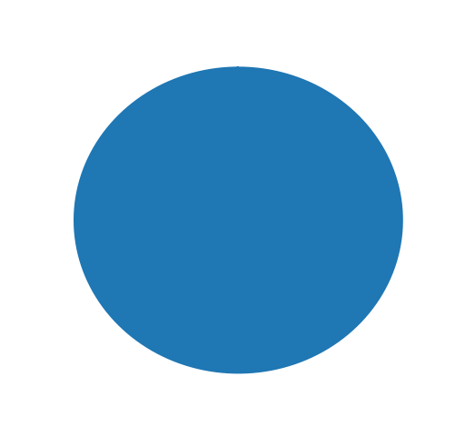
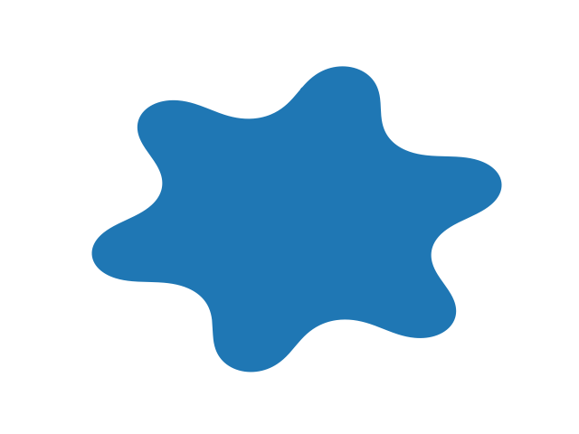
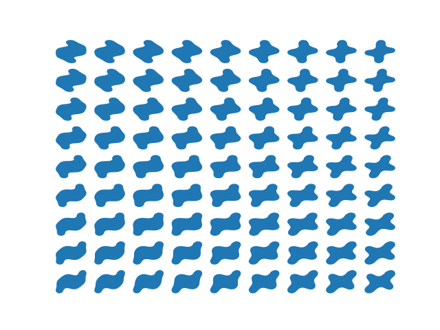
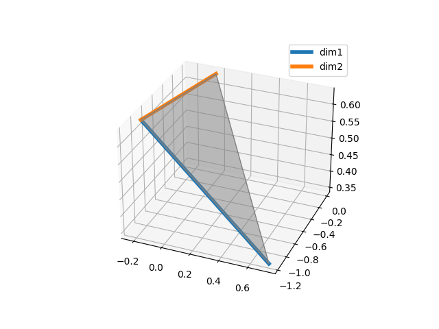

# FourierShapesGenerator
Generation of novel shapes based on fourier descriptors for category learning experiments. 

This repository allows users to create novel shapes using Fourier descriptors. This method is quite helpful for category-learning tasks in cognitive experiments, as it enables presenting participants with completely novel shapes, yet manipulating these shapes according to a strict rule set. Examples of using this method in category learning tasks can be found [here](https://journals.sagepub.com/doi/abs/10.1177/0956797621996663?journalCode=pssa), [here](https://psycnet.apa.org/record/2003-09669-001), and [here](https://www.researchgate.net/publication/237061281_Near_Their_Thresholds_for_Detection_Shapes_Are_Discriminated_by_the_Angular_Separation_of_Their_Corners). This repo also allows users to create 2-dimensional subspaces of shapes, and to sample shapes from this subspace.

## Here are some examples of how to use the code:
### FourierShape class
The methods in this class allows for the generation of a shpae based on fourier descriptors.

This code section plots a random shape that is based on 5 Fourier descriptors. Increasing the number of Fourier descriptors adds complexity to the shape.

    check = FourierShape(num_descriptors = 5)

    check.cumbend_to_points()

    check.plot_shape()

    plt.show()

 

You can also specify the value of each Fourier descriptor, as follows.

    check = FourierShape(num_descriptors = 5, descriptor_amp=[0,0,0,0,0])

    check.cumbend_to_points()

    check.plot_shape()

    plt.show()

 
or 

    check = FourierShape(num_descriptors = 5, descriptor_amp=[0,0,0,1,0])

    check.cumbend_to_points()

    check.plot_shape()

    plt.show()

### ShpaeSubspace class

This class use 3 points on an N-dimentional shapes space in order to
define a 2-dimentional shape subspace, which useful for category learning tasks.
This is done via the gram-schmidt process. In addition, the class enables systematic
sampling from the subspace via normal distribution or uniform distribution (or a mix of the two), 
In order to simulate categories.

The next code section randomly choose 3 points on 4-dimentional shapes space (4 descriptors), 
and randomly generates 2-dim subspace. The shapes in the subspace are then plotted on a 9*9 grid.

    sub = ShapeSubspace(4)
    sub.generate_subspace(1.5)
    sub.plot_shapes_grid(9)
    

When the original shape space dimention (num_descriptors) is 3, 
you can also plot the subspace relative to the original shape space:

    sub.plot_subspace()

The next code line generates 200 shapes, sampled from the 2d subspace by normal
distribution mean=0.5 and sd=0.25 in the first dimention, and uniform distribution in the irrelevant
dimention.

    sub.sample_from_subspace(200,your_directory,1,0.5,plot_hist=True)
